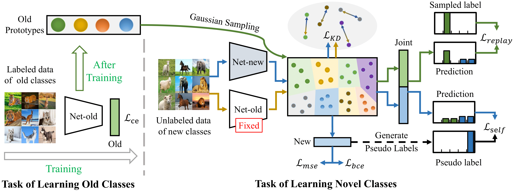
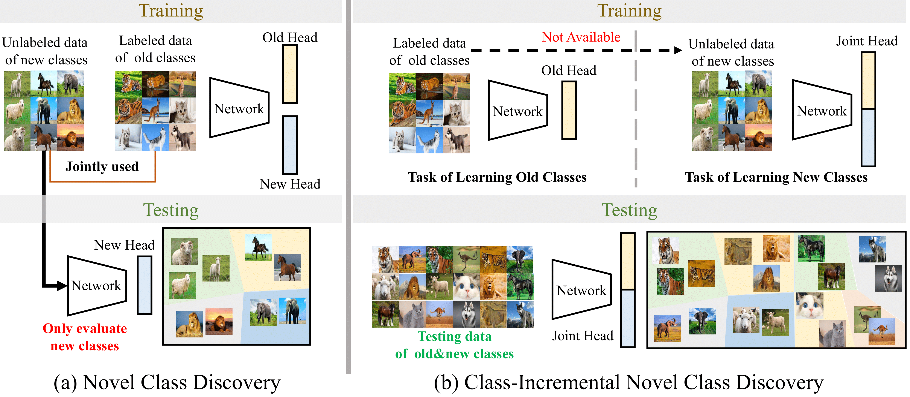
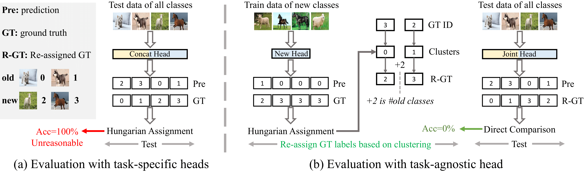
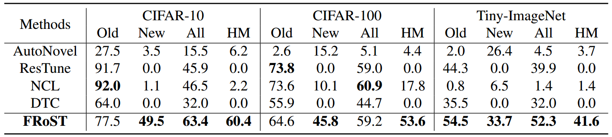
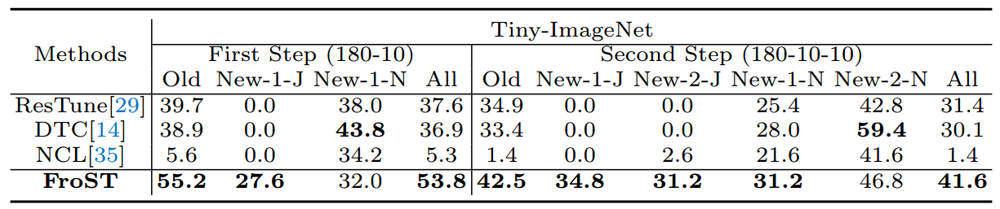
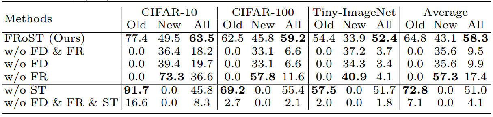
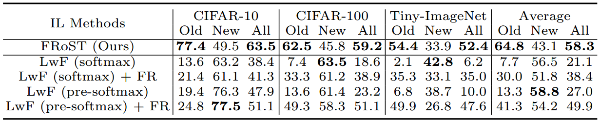
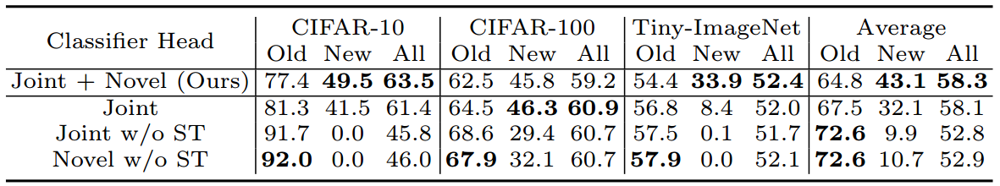

# Class-incremental Novel Class Discovery (ECCV2022)
> Class-incremental Novel Class Discovery (ECCV2022)
>
> Subhankar Roy, Mingxuan Liu, Zhun Zhong, Nicu Sebe, and Elisa Ricci

This Github repository presents the PyTorch implementation for the paper [Class-incremental Novel Class Discovery](), accepted with a poster presentation at European Conference on Computer Vision (ECCV) held at Tel Aviv International Convention Center on October 23-27, 2022.




## Preparation
### Environment
```shell
Python >= 3.8.8
PyTorch >= 1.10.0 
```

`environment.yaml` includes all the dependencies for conda installation. To install (Please pre-install [Anaconda](https://www.anaconda.com/)):
```shell
conda env create -f environment.yaml
```
To activate the installed environment:
```shell
conda activate iNCD
```

### Dataset
- For CIFAR-10 and CIFAR-100 simply download the datasets and put into `./data/datasets/`.
- For TinyImagenet, to download and generate image folders to `./data/datasets/`. Please follow https://github.com/tjmoon0104/pytorch-tiny-imagenet

## Training and Testing


### Step 1: Supervised learning with labelled data
```shell
# For CIFAR10
CUDA_VISIBLE_DEVICES=0 sh step1_scripts/pretrain_cifar10.sh

# For CIFAR100
CUDA_VISIBLE_DEVICES=0 sh step1_scripts/pretrain_cifar100.sh

# For TinyImagenet
CUDA_VISIBLE_DEVICES=0 sh step1_scripts/pretrain_tinyimagenet.sh
```

### Step 2: Class-incremental Novel Class Discovery (class-iNCD) with unlabeled data
```shell
# Train on CIFAR10
CUDA_VISIBLE_DEVICES=0 sh step2_scripts_cifar10/incd_OG_FRoST.sh

# Train on CIFAR100
CUDA_VISIBLE_DEVICES=0 sh step2_scripts_cifar100/incd_OG_FRoST.sh

# Train on TinyImagenet
CUDA_VISIBLE_DEVICES=0 sh step2_scripts_tinyimagenet/incd_OG_FRoST.sh
```

### Two-steps class-iNCD
```shell
# Train on CIFAR100
CUDA_VISIBLE_DEVICES=0 sh two-steps_scripts/auto_2step_incd_OG_FRoST_cifar100.sh

# Train on TinyImagenet
CUDA_VISIBLE_DEVICES=0 sh two-steps_scripts/auto_2step_incd_OG_FRoST_tinyimagenet.sh
```

## Evaluation Protocol


## Evaluation results
Table 1: Comparison with state-of-the-art methods in class-iNCD



Table 2: Comparison with the state-of-the-art methods in the two-step class-iNCD setting where new classes arrive in two episodes, instead of one. New-1-J: new classes performance from joint head at first step, New-1-N: new classes performance from novel head at first step, etc



Table 3: Ablation study on the proposed feature distillation (FD), feature replay (FR) and self-training (ST) that form our FRoST



Table 4: Ablation study comparing FRoST with LwF (logits-KD)



Table 5: Ablation study on having a single and separated heads for old and new classes. Joint: class-agnostic head; Novel: new classes classifier head




### Citation
```
@inproceedings{incd2022,
  title={Class-incremental Novel Class Discovery},
  author={Roy, Subhankar and Liu, Mingxuan and Zhong, Zhun and Sebe, Nicu and Ricci, Elisa},
  booktitle={Proceedings of the European Conference on Computer Vision (ECCV)},
  year={2022}}
```


